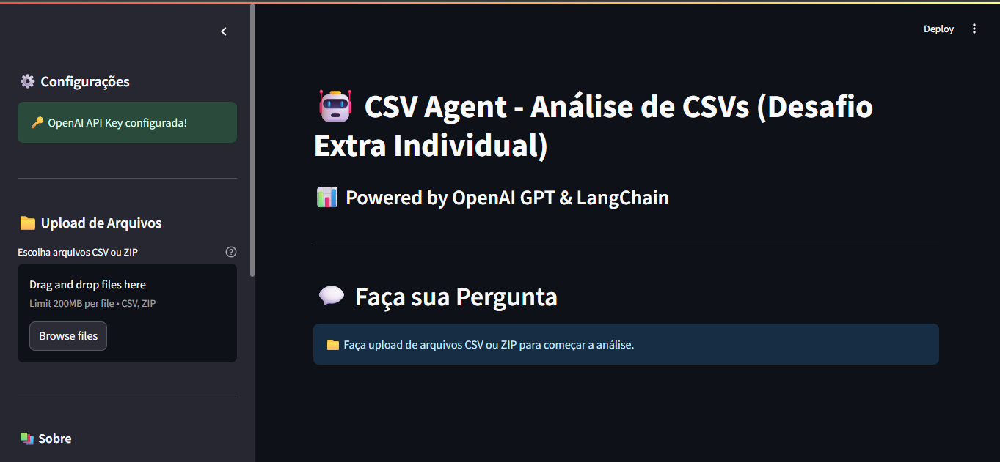
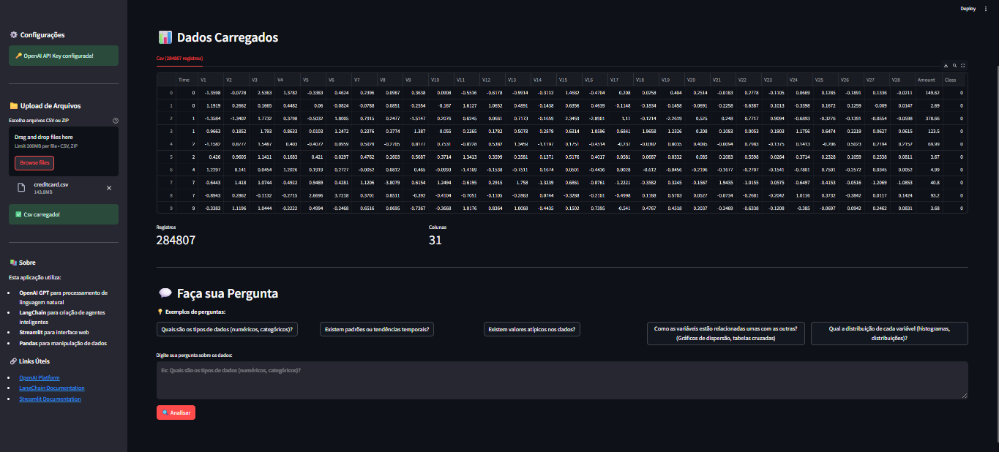

# 🤖 CSV Agent - Análise de CSVs (Desafio Extra Individual)

> **Análise de arquivos CSV usando API OpenAI GPT**

Uma aplicação avançada que permite fazer consultas em linguagem natural sobre arquivos CSV, utilizando **OpenAI GPT API** e **LangChain** para processamento inteligente de dados e **matplotlib** e **seaborn** na geração de gráficos.


## 🌟 Características Principais

- ✅ **Interface Web Intuitiva** com Streamlit
- ✅ **OpenAI GPT API** para processamento de linguagem natural
- ✅ **Modelo GPT-3.5** disponível
- ✅ **Descompactação automática** de arquivos ZIP
- ✅ **Identificação automática** de tipos de arquivo (cabeçalho/itens)
- ✅ **Consultas inteligentes** usando agentes LangChain
- ✅ **Respostas em português brasileiro**
- ✅ **Validação de dados** integrada
- ✅ **Suporte a múltiplos CSVs** simultaneamente
- ✅ **Geração de gráficos** na resposta
- ✅ **Aceita qualquer CSV**


## 🚀 Instalação e Configuração

### Pré-requisitos
- Python 3.8 ou superior
- Conta OpenAI (para API Key)
- Conexão com internet

### ATENÇÃO! O AGENTE PODE NÃO FUNCIONAR SE NÃO HOUVER ESPAÇO SUFICIENTE EM DISCO (PASTA TEMP). VERIFIQUE SE SUA PASTA TEMP NÃO ESTÁ MUITO CHEIA 

### Passo 1: Instalação Automática (Recomendado)

```bash
# Execute o script de instalação das libs
pip install -r requirements.txt
```

### Passo 2: Configure o .env

```bash
# Cole o código abaixo num .env (e subtitua por sua chave da OpenAI)
OPENAI_API_KEY=chave-aqui

# Configurações opcionais do Streamlit
STREAMLIT_SERVER_PORT=8501
STREAMLIT_SERVER_ADDRESS=localhost
```
### Passo 3: Rodar!

```bash
# execute o comando abaixo para abrir a interface de interação com o agente
python -m streamlit run main_openai.py
```

### Passo 4: Adicionar os arquivos e fazer perguntas!

Adicione os arquivos csv na sessão à esquerda e espere serem carregados. 


Quando estiverem prontos, aparecerá uma tabela contendo a pré-visualização dos dados e, abaixo, a sessão de perguntas.

